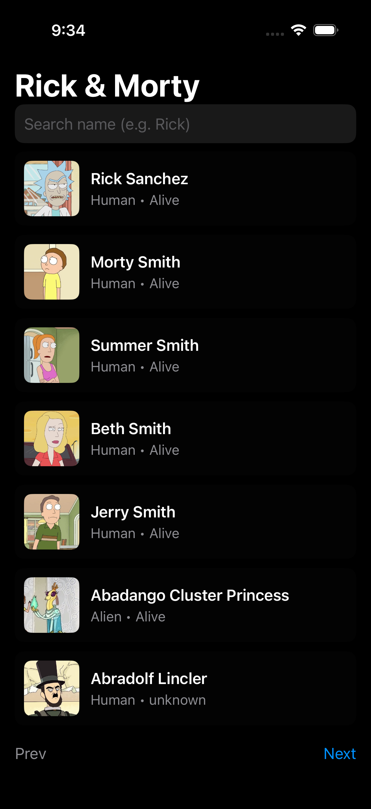
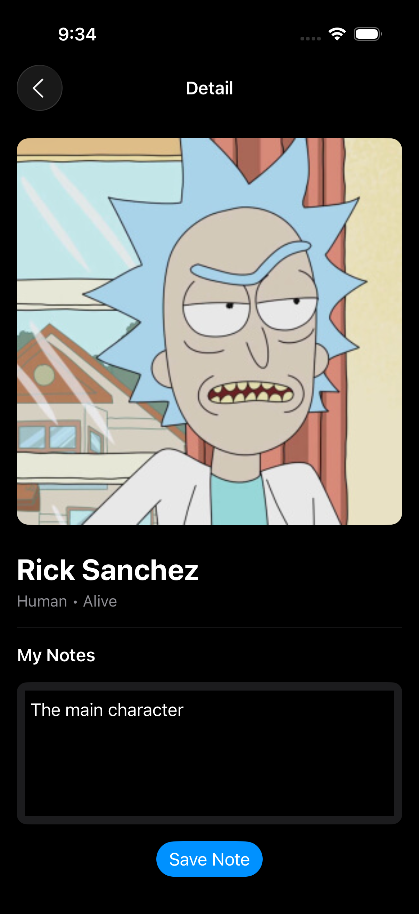

# 🧪 Rick & Morty SwiftUI App

A simple SwiftUI app that fetches characters from the [Rick and Morty API](https://rickandmortyapi.com/documentation) using modern async/await networking.
Users can browse characters, search by name, view details, and save personal notes locally via `UserDefaults`.

---

## 🚀 Features

- Fetches and displays characters from the public Rick & Morty API.
- Pagination with **Next/Prev** buttons.
- Search bar for character name filtering.
- Detail screen with image, species, and status.
- Local note storage per character (persistent using `UserDefaults`).
- Loading and error states managed via `LoadState` enum.
- Structured with **MVVM** for clean separation of concerns.

---

## 🌐 API Endpoints & URL Construction

**Base URL:**
https://rickandmortyapi.com/api/

**Endpoint used:**
GET /character?page=<n>&name=<query>

**Example:**
https://rickandmortyapi.com/api/character?page=2&name=rick

**URL Construction Logic:**
The app uses a helper in `APIClient.swift` that safely builds the request using `URLComponents`, appending path and query items dynamically:

```swift
var comps = URLComponents(url: baseURL.appendingPathComponent(path), resolvingAgainstBaseURL: false)!
comps.queryItems = query
let url = comps.url!
```

Query items are created for pagination (`page`) and search filtering (`name`).

---

## 🧩 Codable Modeling Choices

The data returned by the API has a top-level JSON structure containing an `info` object and a `results` array.
To represent this, the following Swift models were created:

```swift
struct CharactersResponse: Codable {
    let info: Info
    let results: [RMCharacter]
}

struct Info: Codable {
    let count, pages: Int
    let next, prev: String?
}

struct RMCharacter: Codable, Identifiable {
    let id: Int
    let name, status, species, image: String
    let episode: [String]
}
```

These models directly mirror the API response schema, ensuring simple decoding without custom keys or transformations.
All structs conform to `Codable`, `Identifiable`, and `Hashable` to integrate seamlessly with SwiftUI’s `List` and state management.

---

## ⚙️ Architecture Overview

| Layer | Description |
|-------|--------------|
| **Models** | Define Codable structs (`CharactersResponse`, `RMCharacter`, `Info`). |
| **Networking** | `APIClient` handles all requests and JSON decoding using async/await. |
| **ViewModels** | `CharactersVM` manages app state, pagination, and search queries. |
| **Views** | SwiftUI screens (`CharactersView`, `CharacterDetailView`) for list and detail UI. |
| **Helpers** | `CharacterNotes` provides lightweight persistence with `UserDefaults`. |

---

## ⚠️ Known Limitations

- **Error Handling:**
  Currently displays only a generic message (`error.localizedDescription`).
  It doesn’t distinguish between network failures, decoding issues, or empty results.

- **Offline Support:**
  No local caching — requires an internet connection to function.

- **Image Loading:**
  Uses `AsyncImage`, which lacks advanced caching or smoother placeholder transitions.

- **Episode Data:**
  Character episodes are listed as URLs only; the app doesn’t fetch or display their titles.

---

## 💡 Future Improvements

- Implement a **custom error type** (e.g., `NetworkError`) for clearer user feedback.
- Add **image caching** and better placeholder handling for slow connections.
- Introduce **offline persistence** using `CoreData` or file-based caching.
- Fetch and display the **first 3 episode names** for each character.
- Write **unit tests** for networking, decoding, and ViewModel behavior.
- Add theme switching (light/dark) preference stored in `AppStorage`.

---

## 🛠️ Technologies Used

- **SwiftUI** – declarative UI framework
- **Combine** – reactive state binding (`@Published`, `ObservableObject`)
- **Async/Await** – modern concurrency for network calls
- **UserDefaults** – simple local persistence
- **Rick and Morty REST API** – public data source

---

## 📱 Demo

| Character List | Detail View |
|----------------|-------------|
|  |  |

---

## 👨‍💻 Author

- **Christian Bonilla**
- Mobile Development Immersive 1 (iOS) Student
- Project developed as part of a learning exercise for async networking, Codable modeling, and MVVM architecture in SwiftUI.

---

## 📄 License

This project is open source and available under the [MIT License](https://opensource.org/licenses/MIT).